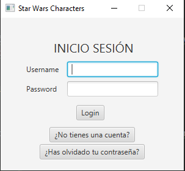
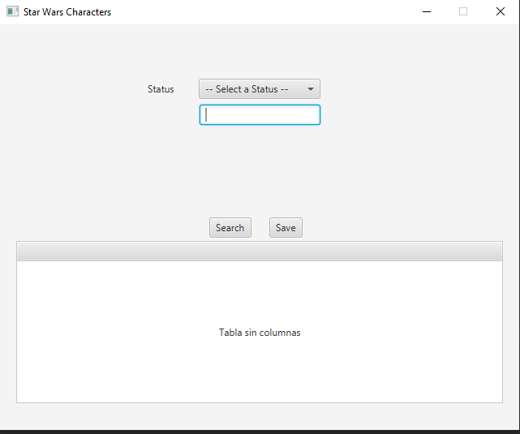
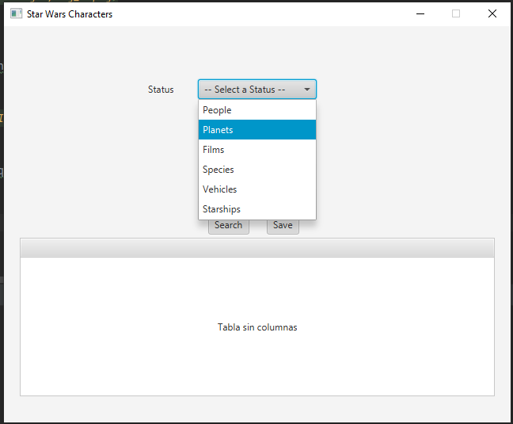
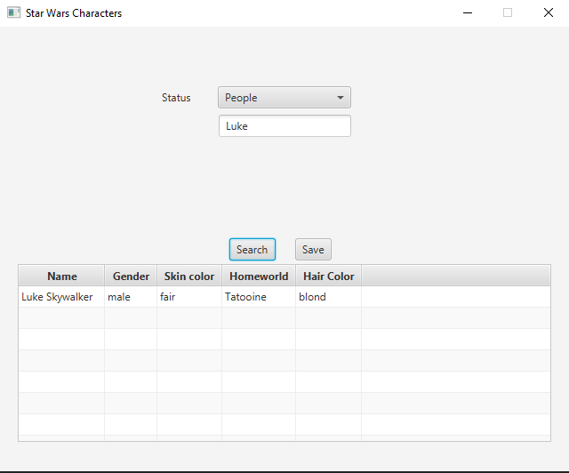
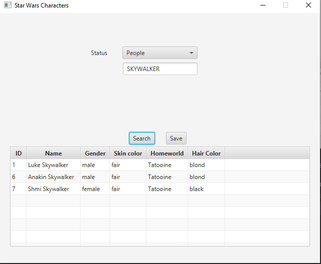
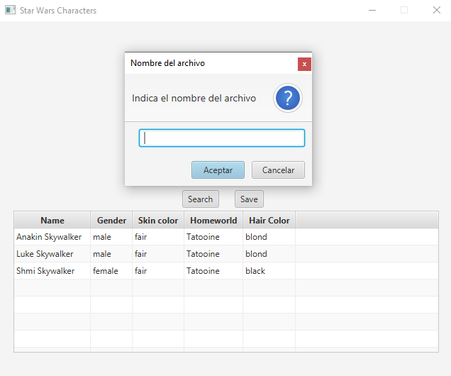

# Memoria
## 1. Introducción.
Para este proyecto se ha utilizado la API SWAPI (Star Wars API). La aplicación sirve para poder consultarla. 
Podemos buscar los nombres de personajes, planetas, las 6 primeras películas, especies existentes en el universo de 
Star Wars, naves y vehículos. En estas dos últimas también se puede consultar por el modelo.
## 2. Manual tecnico para desarrolladores.

#### 2.1. Main.java
En la clase Main tenemos todo lo relacionado con la llamada a ventanas y con el inicio de sesión. 

##### 2.1.1 login()
El método login() es llamado cuando el botón es pulsado y comprueba que los datos introducidos sean los correctos. Si es
así llama a la ventana principal, donde ya podremos hacer nuestras consultas.

#### 2.2. MainController.java
Es el controlador principal, el cual redirecciona a los métodos necesarios para la consulta que se está haciendo en el
momento.

#### 2.3. CharacterController, FilmController, SpeciesController, StarshipController y VehiclesController.
Estas clases son los controladores con los que haremos las peticiones para obtener los datos de la consulta y guardado de
archivos.

##### 2.3.1 set*().
'*' El asterisco indica la clase correspondiente a cada controlador. Por ejemplo, en la clase CharacterController seria
setCharacter().      
Con este método obtenemos de la API todas las coincidencias con la consulta que se haya hecho.
##### 2.3.2 changeHomeworld().
El método changeHomeworld() no está presente en todos los controladores, pero sirve para obtener el nombre del planeta o
planetas necesarios para la tabla. A partir de una URL obtenemos el nombre del planeta.
##### 2.3.4 fillTable().
Este método rellena la tabla con los datos.
##### 2.3.5 saveJson(), saveXML(), saveBin(), saveTxt().
Gracias a estos métodos obtenemos el fichero correspondiente de la consulta que quiere guardar el usuario.
##### 2.3.6 sortList().
Este método ordena los resultados de setCharacters() en orden alfabético. Excepto con las películas que es por orden
numérico
## 3. Manual de usuario.
La aplicación consiste en una ventana de inicio de sesión en la que únicamente le tendremos que pasar usuario y
contraseña(Usuario:admin, Contraseña:renaido).

 

      

Cuando se halla iniciado sesión con las credenciales correctas, la ventana cambiara y pasara a ser la ventana donde 
vamos a hacer nuestras consultas.

 

   
Al lado de la etiqueta donde pone "Status" tendremos que seleccionar lo que queremos buscar. 

 

   
Cuando seleccionemos alguna de las opciones, tendremos que escribir en el campo de abajo lo que queremos buscar.
Por ejemplo: en la siguiente captura buscaremos a Luke.

 

Vemos como en la tabla nos devuelve varios datos sobre Luke.
También podríamos buscar a la familia Skywalker:

 

Y en este caso nos devuelve a todos los miembros de la familia.

Si quisiésemos guardar archivos sobre nuestra última consulta, sencillamente le daremos al botón
"Save" y este a través de una ventana de diálogo nos pedirá un nombre para el archivo.

 

Después de indicar el nombre del archivo, se nos creará 1 archivo json, 1 archivo xml, 1 archivo bin y 1 archivo txt
formateado en CSV.
## 4. Reparto de tareas.
Nos hemos repartido las tareas asignándonos puntos necesarios del proyecto en pequeñas partes
e ir poco a poco armando todo el proyecto.
* Adrián: Llamada a la API para obtener los datos, guardado de archivos, ordenación de los resultados de la búsqueda y
  ventana de login y su lógica.
* José: Rellenado de la table, cambio de la URL del planeta natal por el nombre real, creación del MainController y
  cifrado de la contraseña de inicio de sesión.
## 5. Extras
* Ordenación de resultados de las consultas y almacenaje de los datos
* Control de errores (errores de ficheros, consultas sin resultados...)
* Adición de un login con usuario y contraseña contenidos en un fichero de Properties con la contraseña encriptada.
## 6. Propuestas de mejora.
* Mejora de la interfaz por completo
* Agregar un registro
* Guardado de peticiones de cada usuario
* Optimización de código en general
## 7. Conclusiones
* Adrián: Ha sido un proyecto bastante interesante, nunca había trabajado con una API ni con JavaFx y ha sido divertido
buscar el cómo hacer todo lo necesario para que el proyecto funcionara como queríamos. Le he dedicado bastante tiempo al 
* proyecto, no sé cuanto exactamente, pero más de 10 horas probablemente. Yo creo que sacaremos un 8 o un 9.
* José: Es un buen proyecto para introducirse a las peticiones de una API y si no se vio sobre JSON más de lo mismo, es 
un buen proyecto para iniciar, le he dedicado las horas de clase y mas de 5 horas en casa. Espero sacar un 8.
