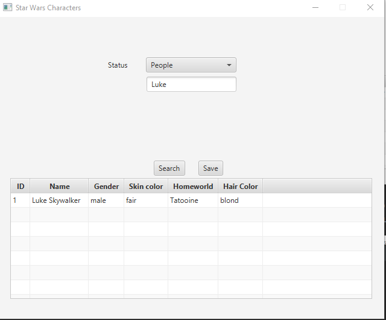
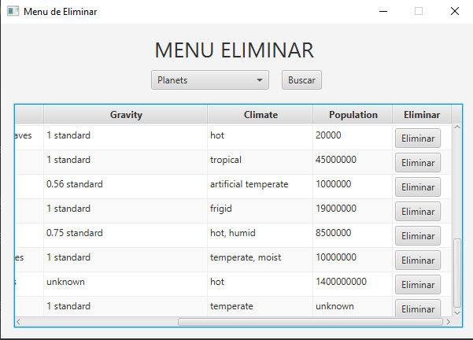

# Memoria
## 1. Introducción.
Para este proyecto se ha utilizado una base de datos basada en los datos de la API SWAPI (Star Wars API). La aplicación sirve para poder consultarla.
Podemos buscar los nombres de personajes, planetas, las 6 primeras películas, especies existentes en el universo de
Star Wars, naves y vehículos.
## 2. Manual tecnico para desarrolladores.

#### 2.1. Main.java
En la clase Main tenemos todo lo relacionado con la llamada a ventanas y con el inicio de sesión. 

##### 2.1.1 btnEvent()
El método btnEvent() es llamado cuando el botón es pulsado y dependiendo de la ventana que se muestre hará diferentes tareas.
1. Si estamos en la ventana de inicio de sesión, comprueba que los datos introducidos sean los correctos. Si es
   así, llama a la ventana principal, donde ya podremos hacer nuestras consultas.
2. Si estamos en la ventana de registro introduce en la base de datos el nuevo usuario
3. Si estamos en la ventana de cambio de contraseña, se cambiará la contraseña del usuario introducido. No es un método seguro
   para cambiar contraseñas, en futuras versiones se mandará un correo a la cuenta de correo introducida al crear la cuenta para
   verificar que la persona que cambia la contraseña es el usuario de la cuenta.
#### 2.2. MainController.java
Es el controlador principal, el cual redirecciona a los métodos necesarios para la consulta que se está haciendo en el
momento.

#### 2.3. CharacterController, FilmController, SpeciesController, StarshipController y VehiclesController.
Estas clases son los controladores con los que haremos las peticiones para obtener los datos de la consulta y guardado de
archivos.

##### 2.3.1 show*().
'*' El asterisco indica la clase correspondiente a cada controlador. Por ejemplo, en la clase CharacterController seria
setCharacter().      
Con este método obtenemos de la base de datos todas las coincidencias con la consulta que se haya hecho.
##### 2.3.4 fillTable().
Este método rellena la tabla con los datos.
##### 2.3.5 saveJson()
Con este método obtenemos el fichero JSON de la consulta que quiere guardar el usuario.
##### 2.3.6 creacionDelete()
Es el método que utilizamos para poder eliminar una tupla de la base de datos.
##### 3.3.7 creacionInsert()
Es el método que utilizamos para poder añadir una tupla en la base de datos.
## 3. Manual de usuario.
La aplicación consiste en una ventana de inicio de sesión en la que podremos registrar una nueva cuenta, cambiar la contraseña o iniciar sesión.

 

      
Si le damos al botón con el texto "¿No tienes una cuenta?" nos redirigirá a una ventana en la que podremos introducir
los datos necesarios para crear una nueva cuenta.

 

   

En cambio, si le damos al botón "¿Has olvidado tu contraseña?" nos redirigirá a una ventana en la que podremos introducir
el usuario al que queremos cambiar la contraseña y la nueva contraseña.

 

 

Por último si introducimos unos datos correctos, al iniciar sesión nos mostrará un menú que nos dará 4 opciones.

1.Consultar la base de datos.

2.Insertar nuevas tuplas en la base de datos.

3.Modificar tuplas en la base de datos (No funciona, en desarrollo).

4.Eliminar tuplas de la base de datos.

 

En el botón para consultar nos mostrará el siguiente menú

 

   
Al lado de la etiqueta donde pone "Status" tendremos que seleccionar lo que queremos buscar. 

 

   
Cuando seleccionemos alguna de las opciones, tendremos que escribir en el campo de abajo lo que queremos buscar.
Por ejemplo: en la siguiente captura buscaremos a Luke.

 

Vemos como en la tabla nos devuelve varios datos sobre Luke.
También podríamos buscar a la familia Skywalker:

 

Y en este caso nos devuelve a todos los miembros de la familia.

Si quisiésemos guardar archivos sobre nuestra última consulta, sencillamente le daremos al botón
"Save" y este a través de una ventana de diálogo nos pedirá un nombre para el archivo.

 

Después de indicar el nombre del archivo, se nos creará 1 archivo json.

Volviendo al menú de opciones, si en lugar de las consultas hubiésemos elegido insertar una tupla nos mostraría el siguiente menú.

 

Igual que en las consultas tendremos que seleccionar que queremos insertar. Cuando ya tengamos seleccionado lo que queremos
buscar y demos al botón "Buscar". Nos mostrará los campos de texto necesarios para una nueva tupla de lo que hallamos seleccionado
y las tuplas que ya existen en la base de datos.

 

Cuando rellenemos dichos campos de texto con datos correctos, dándole al botón "Agregar" se introducirá la nueva tupla

 

El planeta introducido es el que tiene ID 21.

Por último, el botón de eliminar del menú de opciones.

Si le damos al botón nos llevará al siguiente menú.

 

Igual que en los anteriores, tenemos que seleccionar una opción.

 

Si arrastramos la tabla hacia la derecha, veremos el botón de eliminar. Si le damos se eliminará la tupla de la misma línea.

 

En este caso he borrado el planeta creado en el apartado anterior llamado "PlanetaFicticio".

## 4. Reparto de tareas.
Nos hemos repartido las tareas asignándonos puntos necesarios del proyecto en pequeñas partes
e ir poco a poco armando todo el proyecto.
* Adrián: Creación de la base de datos para el inicio de sesión, inserciones de datos en la base de datos principal del
proyecto y creación de varias tablas, ventanas y código necesarios para el inicio de sesión, registro de cuentas y cambio de
contraseña.
* José: Parte de la base de datos principal, adaptación del código para conectar a la base de datos en vez de a la API y ha creado las nuevas ventanas
y el código de los apartados de insertar y eliminar.
## 5. Extras
* Ordenación de resultados de las consultas y almacenaje de los datos
* Control de errores (errores de ficheros, consultas sin resultados...)
* Adición de un login (control de acceso restringido) con usuario y contraseña. Se realizará a través de una BBDD distinta, 
que almacene la información de los usuarios(5 %). Se incorporan las premisas mínimas de seguridad para el acceso(10%).

## 6. Propuestas de mejora.
* Mejora de la interfaz por completo
* Cambio de contraseña mas seguro
* Optimización de código en general
* Añadir la modificación de tuplas
## 7. Conclusiones
* Adrián: El proyecto ha estado muy bien para saber como trabajar con datos en una base de datos y además también para saber
  adaptar otros trabajos con otros métodos. Le he dedicado las horas de clase y 2-3 horas en casa. Yo creo que sacaremos un 8.
* José: El proyecto esta muy bien para saber adaptarte a las metodologías que se emplean para el volcado de datos, 
satisfecho con el trabajo realizado por el tiempo que se le dedico que fueron horas en clase y un par de horas en casa.
  Cualificacion estimada un 8, porque faltan implementar unas cosas que se harán a futuro
